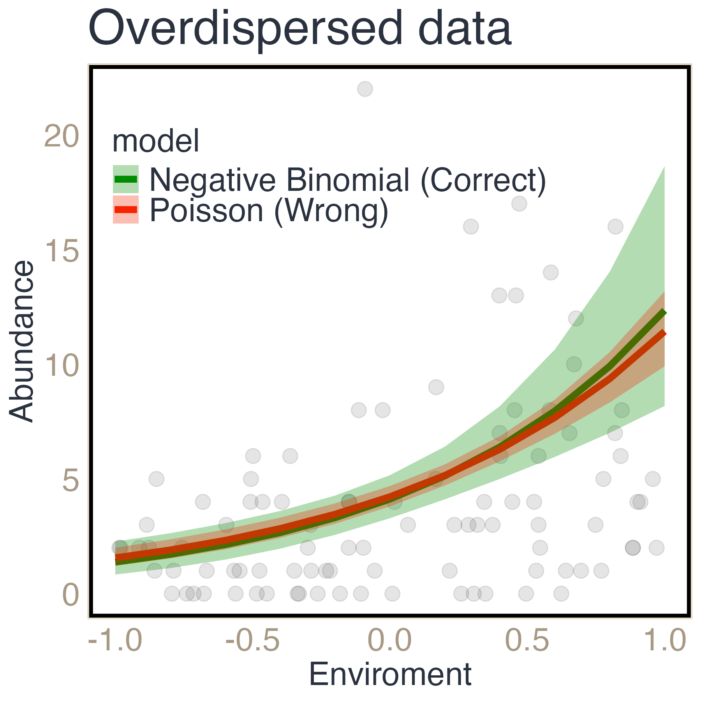
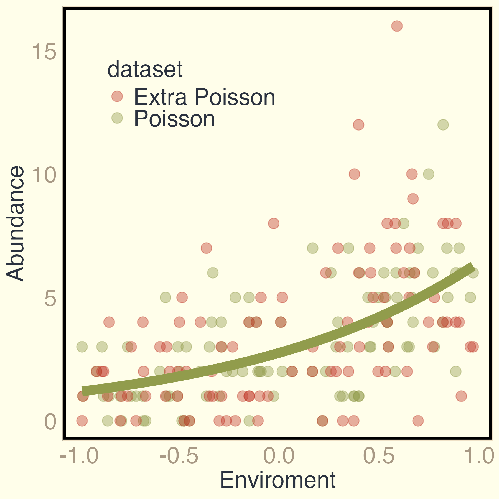
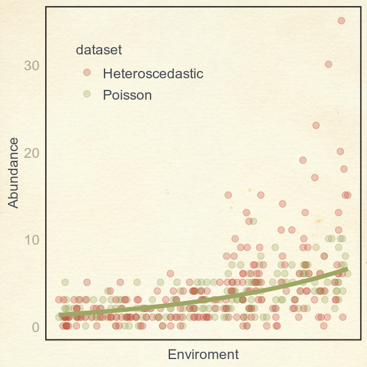
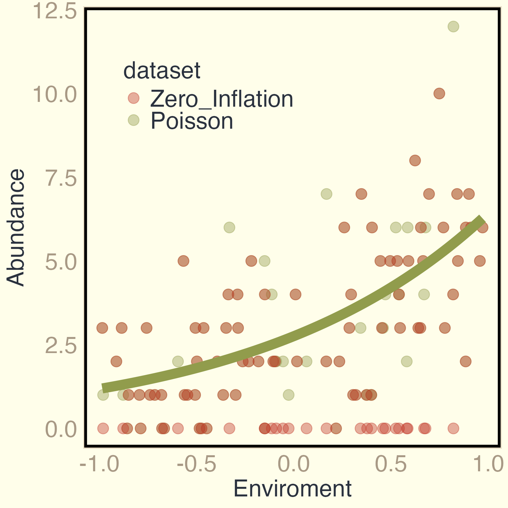

```{r, echo=F, warning=F, message=F, results='hide',fig.keep='none'}
knitr::opts_chunk$set(cache = T, fig.align = 'center', echo = F, 
                      warning = F, message = F,
                      fig.height = 4, fig.width = 4)
library(knitr)
library(tidyverse)
library(cowplot)
library(DHARMa)
library(glmmTMB)
library(ggeffects)
theme_set(theme_cowplot() + theme(panel.background = element_rect(color="black")))
source("simulations_problems.R")
```


## Replicability crisis in Ecology too? {.smaller}


::::: columns

::: {.column width="70%"}

\

- High **false positive rates** (type I error) in Ecological studies

- A non-intentional cause is **failing in checking model's assumptions**

- Researchers **don't check models** -> higher chances of false conclusions

- Few tools for **model diagnostics** of GLMs, GLMMs.
:::

::: {.column width="30%"}
{fig-align="left" width="400"}
:::
:::::

::::: columns
::: {.column width="40%"}

{fig-align="right" width="300"}

:::

::: {.column width="60%"}

\
\


<p style="text-align: center; font-size: 44px; color: red;"> **Can you trust your model?** </p>

:::
:::::


::: notes
Why is that important for, us, Ecologists?
It is not new that in many scientific areas, including ecology, there is a large amount of research with false positive rates, that is, when they claim they found a significant result, but this is not true.
There are many questionable research practices that may lead to this problem, one of them is failing in checking models assumptions. In reality, many researchers simply don't even check models and this leads to higher chances of false and unreplicable results. 
This is especially important for generalized linear models and other more complex models, where there are few tools for models diagnostics.

The question I start my presenteation is: can you trust your model?

:::


## OVERDispersion problems {.smaller}

\

<p style="text-align: center;">When data has **more variability than expected** by the model (GLM/GLMM) </p>


::::: columns

::: {.column width="5%"}
:::
::: {.column width="45%"}

\

**OVERDISPERSION**

-   Too small standard error / confidence intervals 

-   Larger chance of **false positive** results

-   Much more common than previously thought


:::

::: {.column width="50%"}
{fig-align="center" width="400"}

:::
:::::


::: notes
One very important issue with model diagnostics is to detect dispersion problems, and the most common dispersion problem is OVERDISPERSION, where the data has more variability than expected by the model.
If you ignore it, the most clear consequence is that you have estimated too small standard errors, this means that you think you have lower uncertainty, and smaller confidence intervals, but in reality your data says the opposite. This increases the chance of false positive results, and we saw the consequences of it for the scientific community.

Here I'm showing a very common problem of a count data, for example the abundance of a species along a environmental gradient. However, this data has more variability than expected by the Poisson GLM I'm trying to fit. So, when we model it with a Poisson GLM, we will have this very narrow confidence interval of the estimates in red, and we may think this model is great but it is the other way around. In green, we have a model with another distribution, here negative binomial, that takes into account this extra variability in the count data and then provide a better model for the data at hand.
:::


## GOALS {.smaller}

\

- Aware ecologists of dispersion problems in GLMs/GLMMs

\

- Identify and describe the 3 main causes by using model diagnostics tools with the `DHARMa` R package

\

- Show some modeling solutions for these causes, with the `glmmTMB` R package 

::: notes
So, the goal of this presentation is to ...  
:::

##  {background-image="images/background.png"}

\

{fig-align="center" width="50"}

\

<p style="text-align: center; font-size: 60px;"> Detecting dispersion problems with `DHARMa` </p>

\

\

::: notes
Let me introduce you to the DHARMa package first...
:::


## Residual diagnostics with `DHARMa` {.smaller}

-   Scaled quantile residuals -\> Simulating from the model

-   Residuals between 0 and 1 for ANY model complexity or distribution

-   Interpreted the SAME way:

```{r, fig.width=8}
data <- createData(randomEffectVariance = 0)
res <- simulateResiduals(glm(observedResponse ~ Environment1, data=data,
                           family="poisson"))
par(mfrow = c(1,2))
plotQQunif(res, testUniformity = F, testOutliers = F, testDispersion = F)
plotResiduals(res)
```

::: notes
The DHARMa approach is to generate a specific type of residuals, the scale
quantile residuals, by simulating many new datasets from your model. The advantange of these residuals is that it is standardized between 0 and 1 for any distribution and model complexity, and they should be interpreted the same way. That is, if your model is good the residuals should present an uniform distribution, a flat distribution between zero and 1. 
These are the two main diagnostics plot from DHARMa, one quantile-quantile plot that you expect that the residuals (black dots) should align with the diagonal red line, and the other the residuals agains the fitted values, which we would expect a uniform distribution of them along the fitted
values, reprsented by these 3 black horizontal lines. 
Now, let's check if DHARMa residuals can detect dispersion problems in the data...
:::

## Detecting overdispersion {.smaller}


::::: columns
::: {.column width="50%"}

Wrong model
```{r, echo=T, eval=F}
m <- glmmTMB(Abundance ~ Environment + (1|group),
        family = poisson(), data = data)
res <- simulateResiduals(m)
plot(res)
testDispersion(res)
```

```{r, echo=F, fig.width=8}
par(mar=c(4,4,1,1))
plot(overResWrong)
testDispersion(overResWrong, plot=F) -> val
```

<p style="text-align: center;color: red;">Dispersion  = `r round(val$statistic,2)`, p-value = `r val$p.value`. </p>

:::

::: {.column width="50%"}

:::
:::::


::: notes
We start with the model we believe fits our your data, here I'll continue with the example of the species abundances being modeled by an enviromental variable. So we fit a poisson GLMM, we simulate the residuals with DHARMa and we plot the residuals. 
This plot is quite different to what we saw before, right? We see many red colors for residual tests, that is significant departing from what is expected. the residuals are not aligned in the qq plot and the expected flat lines in the plot of the residuals agains the fitted values are not flat anymore.
DHARMa has a function to test for overdispersion, and we see here that it is significant and high. the dispersion parameter should be around 1 and here is larger than 5. Indicating high overdispersion
:::

## Detecting overdispersion {.smaller}


::::: columns
::: {.column width="50%"}

Wrong model
```{r, echo=T, eval=F}
m <- glmmTMB(Abundance ~ Environment + (1|group),
        family = poisson(), data = data)
res <- simulateResiduals(m)
plot(res)
testDispersion(res)
```

```{r, echo=F, fig.width=8}
par(mar=c(4,4,1,1))
plot(overResWrong)
testDispersion(overResWrong, plot=F) -> val
```

<p style="text-align: center;color: red;">Dispersion  = `r round(val$statistic,2)`, p-value = `r val$p.value`. </p>

:::

::: {.column width="50%"}
Solution 
```{r, echo=T, eval=F}
#| code-line-numbers: 2
m <- glmmTMB(Abundance ~ Environment + (1|group),
        family = nbinom2(), data = data)
res <- simulateResiduals(m)
plot(res)
testDispersion(res)
```

```{r, echo=F, fig.width=8}
par(mar=c(4,4,1,1))
plot(overResCorrect)
testDispersion(overResCorrect, plot=F) -> val
```

<p style="text-align: center;">Dispersion  = `r round(val$statistic,2)`, p-value = `r val$p.value`. </p>

:::
:::::

::: notes
A possible solution I have already presented is to model it with the negative binomial distribution, which can handle the extra variability in the data. Then we we model it with glmmTMB and look at the DHARMa residuals, we find that everything is good again, residuals rare flat and don't show any pattern!
:::


## Another overdispersion problem

\

What if...

\

<p style="text-align: center;"> the variability in the data increases/decreases with a specific variable? </p>

\

<p style="text-align: center; color: red;font-size: 55px"> **Heteroscedasticity** </p>


::: notes
Howver, life is not that simple. 
We may also see in our data that the variability increases or decreases with a variable. That is, there is something causing that variability to change. This is called heteroscedasticity, and it may be also quite common in GLMs. 
Let's check the residuals in this case
:::

## Detecting heteroscedasticity {.smaller}


::::: columns
::: {.column width="50%"}

Wrong model
```{r, echo=T, eval=F}
m <- glmmTMB(Abundance ~ Environment + (1|group),
        family = poisson(), data = data)
res <- simulateResiduals(m)
plotResiduals(res, form = data$Environment1,
              absoluteDeviation = T)
testDispersion(res)
```

```{r, echo=F, fig.height=3.5, fig.width=3.5}
plotResiduals(heteroResWrong, form = heteroData$Environment1,
              absoluteDeviation = T)
testDispersion(heteroResWrong, plot=F) -> val
```

<p style="text-align: center;color: red;">Dispersion  = `r round(val$statistic,2)`, p-value = `r val$p.value`. </p>

:::

::: {.column width="50%"}

:::
:::::

::: notes
Here I have the very same wrong model, and now I'm showing you another plot, which is the DHARMa residuals against the predictor variable, in our case the enviromental gradient. This plot is particularly good to detect heteroscedasticity - because we search for patterns in the residuals agains our predictors.

:::

## Detecting heteroscedasticity {.smaller}


::::: columns
::: {.column width="50%"}

Wrong model
```{r, echo=T, eval=F}
m <- glmmTMB(Abundance ~ Environment + (1|group),
        family = poisson(), data = data)
res <- simulateResiduals(m)
plotResiduals(res, form = data$Environment1,
              absoluteDeviation = T)
testDispersion(res)
```

```{r, echo=F, fig.height=3.5, fig.width=3.5}
plotResiduals(heteroResWrong, form = heteroData$Environment1,
              absoluteDeviation = T)
testDispersion(heteroResWrong, plot=F) -> val
```

<p style="text-align: center;color: red;">Dispersion  = `r round(val$statistic,2)`, p-value = `r val$p.value`. </p>

:::

::: {.column width="50%"}
Solution 
```{r, echo=T, eval=F}
#| code-line-numbers: 2-3,5-6
m <- glmmTMB(Abundance ~ Environment + (1|group),
        dispformula = ~ Environment, # dispersion formula
        family = nbinom2(), data = data) # negative binomial
res <- simulateResiduals(m)
plotResiduals(res, form = data$Environment1,
              absoluteDeviation = T)
testDispersion(res)
```

```{r, echo=F, fig.height=3.5, fig.width=3.5}
plotResiduals(heteroResCorrect, form = heteroData$Environment1,
              absoluteDeviation = T)
testDispersion(heteroResCorrect, plot=F) -> val
```

<p style="text-align: center;"> Dispersion  = `r round(val$statistic,2)`, p-value = `r val$p.value`. </p>

:::
:::::

::: notes
For heteroscedasticity, a good solution is to model the variation, in glmmTMB we can do it using this argument `dispformula` to say which variable we believe is creating heteroscedasticity. Now, applying that and checking the residuals, we can see that the pattern is over and that the dispersion test is also smaller and nonsignificant.
:::

## What if... 

\

<p style="text-align: center;"> You have more zeros than expected by the model??
 </p>

\

<p style="text-align: center; color: red;font-size: 55px"> **Zero-inflation** </p>

::: notes
Well, there is another problem that may create an apparent overdispersion. this is the exces of zeros in your data, given your model.  
Let's have a look at the residuals of a model ignoring the zero-inflation...
:::


## Detecting zero-inflation {.smaller}

::::: columns
::: {.column width="50%"}

Wrong model
```{r, echo=T, eval=F}
m <- glmmTMB(Abundance ~ Environment + (1|group),
        family = poisson(), data = data)
res <- simulateResiduals(m)
plot(res)
testZeroInflation(res)
```

```{r, echo=F, fig.width=8}
par(mar=c(4,4,1,1))
plot(zeroResWrong)
testZeroInflation(zeroResWrong, plot=F) -> val
```

<p style="text-align: center;color: red;">Zero-inflation  = `r round(val$statistic,2)`, p-value = `r val$p.value`. </p>

:::

::: {.column width="50%"}

:::
:::::

::: notes
Well, not good! 
here I want to highlight the DHARMa function to test for zero-inflation. Like the test for overdispersion, a good value would be 1, and we can see here is larger than 5!
:::

## Detecting zero-inflation {.smaller}


::::: columns
::: {.column width="50%"}

Wrong model
```{r, echo=T, eval=F}
m <- glmmTMB(Abundance ~ Environment + (1|group),
        family = poisson(), data = data)
res <- simulateResiduals(m)
plot(res)
testZeroInflation(res)
```

```{r, echo=F, fig.width=8}
par(mar=c(4,4,1,1))
plot(zeroResWrong)
testZeroInflation(zeroResWrong, plot=F) -> val
```

<p style="text-align: center;color: red;">Zero-inflation  = `r round(val$statistic,2)`, p-value = `r val$p.value`. </p>

:::

::: {.column width="50%"}
Solution 
```{r, echo=T, eval=F}
#| code-line-numbers: 2-3,6
m <- glmmTMB(Abundance ~ Environment + (1|group),
        ziformula = ~ 1,  # zero-inflation formula
        family = poisson(), data = data) 
res <- simulateResiduals(m)
plotResiduals(res)
testZeroInflation(res)
```

```{r, echo=F, fig.width=8}
par(mar=c(4,4,1,1))
plot(zeroResCorrect)
testZeroInflation(zeroResCorrect, plot=F)-> val
```

<p style="text-align: center;"> Zero-inflation   = `r round(val$statistic,2)`, p-value = `r val$p.value`. </p>

:::
:::::

::: notes
Again, using glmmTMB we can also model the excess of zeros, using the argumento ziformula. In this example I just said that my data has more zeros than expected by the poisson. and by doing that I have a model that has very nice DHARMa residuals!
no pattern, no sing of zero inflation anymore!
:::

## 3 causes of dispersion problems {.smaller}

::::: columns
::: {.column width="33%"}

<p style="text-align: center;"> **"Real" overdispersion:** </p>

{fig-align="center" width="300"}

<p style="text-align: center;"> Abundances vary more that expected by the model, in general. </p>
:::

::: {.column width="33%"}
<p style="text-align: center;"> **Heteroscedasticity:** </p>
{fig-align="center" width="300"}

<p style="text-align: center;"> Abundances variation increases with the environmental gradient. </p>
:::

::: {.column width="34%"}
<p style="text-align: center;"> **Zero-inflation:** </p>
{fig-align="center" width="300"}

<p style="text-align: center;"> More zero abundances than expected by the model. </p>
:::
:::::


::: notes
Now we know a bit about the 3 main causes of overdispersion problems, and how we can detect and model it. 
For all this problems, we can see that the green Poisson model adjusted will fail in predicting observations that are too far, given that there are extra variability that you are ignoring. If you choose to ignore it, we know the consequences.
:::


## Detecting dispersion problems {.smaller}

\

-   Residual patterns alone will not tell you which is the cause of
    overdispersion. E.g.:
    
      -  'Real' overdispersion will show significant test for zero-inflation, and vice-versa.
      
      - 'Real' overdispersion and zero-inflation may have significant heteroscedasticity.

\

-   Additional check: fit models addressing the potential problems and
    compare their fit (e.g. AIC, LRT) and residuals diagnostics.
    

<p style="text-align: center; font-size: 44px;"> `DHARMa` + `glmmTMB` </p>

::: notes
Don't always assume the most complex/complicated model is the correct one!
:::

## Conclusion {.smaller}

\

-   There are many causes of dispersion problems in GLMMs. To ignore it may lead fo false conclusions

\

-   Use `DHARMa` residuals tools to detect them

\

-   Address the problem with adequate models, e.g, `glmmTMB`

\


<p style="text-align: center; font-size: 44px; color: red;"> **Can you trust your model, now?** </p>

::: notes
There are many other types of problems, especially talking about GLMMs, where
the issue may not just be at the distribuion/observation level but also at the
random effects level.
:::

## Take-home message {.smaller}

\

-   Models should ALWAYS be checked: residual diagnostics!

\

-   Avoid an oversimplistic view of dispersion problems

\

-   Detecting and addressing the causes of dispersion problems may also be
    informative for your system/data.

\

Comming soon: 
<p style="text-align: center;">Leite et al. *in prep.* **Dispersion tests in GLMMs: a methods comparison and practical guide.** </p>


##  {background-image="images/background.png"}

\


\

<p style="text-align: center; font-size: 70px;"> Thank you! </p>

{fig-align="center" width="300"}

<p style="text-align: center; font-size: 70px;"> Vielen Dank! </p>

\

<p style="text-align: center; font-size: 20px;"> Thanks to Max Pichler and the Theoretical Ecology Lab group </p>

